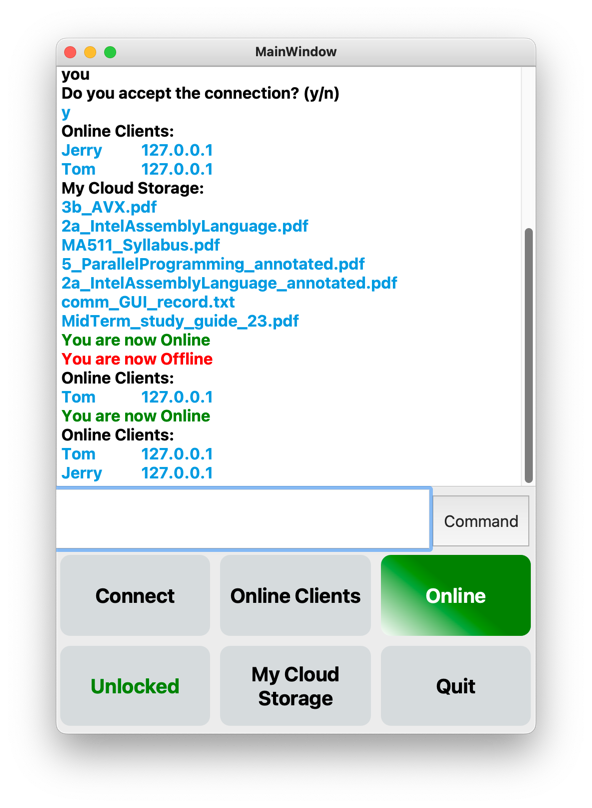
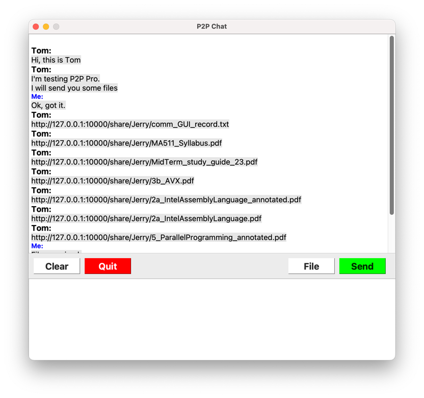

# P2P Pro - EC530
This is EC530 P2P Pro project.

Presentation Link: https://docs.google.com/presentation/d/1jCKI4AsXwgbstk6mi6an6p3H3BnKyAKw_XqlJ0u-bXA/edit?usp=sharing

## Requirements

### <span style="color:red">This program's full function works on macOS only, don't run it on Windows or Linux.</span>

### <span style="color:red">This program's full function works on macOS only, don't run it on Windows or Linux.</span>

### <span style="color:red">This program's full function works on macOS only, don't run it on Windows or Linux.</span>

<div style="display:flex">
  
  
</div>

## P2P Chat Console with GUI - console_GUI.py

This is a P2P chat program written in Python. It is based on the console version, but it has a GUI interface and more functions.

It allows multiple clients to connect to a user and communicate with each other.

In this program, there is only one console window for all functions, you can call functions by using buttons, so it's easy to use.

Compared to the console version, this version has a GUI interface, so it's more user-friendly. In addition, it has more functions, such as sending files, sending images.

In addition, chatting with other clients is using different processes, so it won't block the main process, you can continue to using other functions while chatting with other clients, including connecting to other clients and receive new connections.

### Features of this program:

1. It has connection confirmation process, so you can reject connections from other clients.
2. It can send all kinds of files, including images, documents, even python codes.
3. It uses multithreading and multiprocessing, chatting with other clients is continuously, you can send as many messages as you want.
4. Moreover, the processing of connecting other clients is total automatic, you don't need to do anything, just wait for new terminals to show up.
5. Robust, chatting windows can be closed without affecting the main process and the listening thread wouldn't block the console window's main functions.

### How to use

All functions are in the console window, you can call functions by using buttons.

## Communication Program with GUI - comm_GUI.py

This is a communication program written in Python. This is a simple Python program for socket communication. It can be used to establish a connection between two machines and send/receive messages.

In this version, comm_GUI also has a GUI interface, so calling it separately is not easy because it needs more arguments. So it is recommended to use it with console_GUI.py.

### Using server mode
Directly using the file:
```shell
python communication.py server <ip> <port> <path> <username>
```

ip is the ip address of the server be bind to

port is the port of the server listens to

### Using client mode
Directly using the file:
```shell
python communication.py client <ip> <port> <path> <username>
```

## Central Server Service - central_server.py

This is the core of the P2P Pro project. It is a central server service written in Python. It is used to manage the connection between clients and provide the IP address of the client to other clients.

### How to use

Just run the file:
```shell
python central_server.py
```


License
This program is released under the MIT License. See the LICENSE file for details.